 # CCBar

一个 IntelliJ IDEA 插件，在工具栏中添加可配置的快捷按钮，用于在终端中快速启动命令。主要使用场景是以不同参数组合启动 AI 编程助手（如 Claude Code），也适用于任何需要频繁执行的命令行工具。

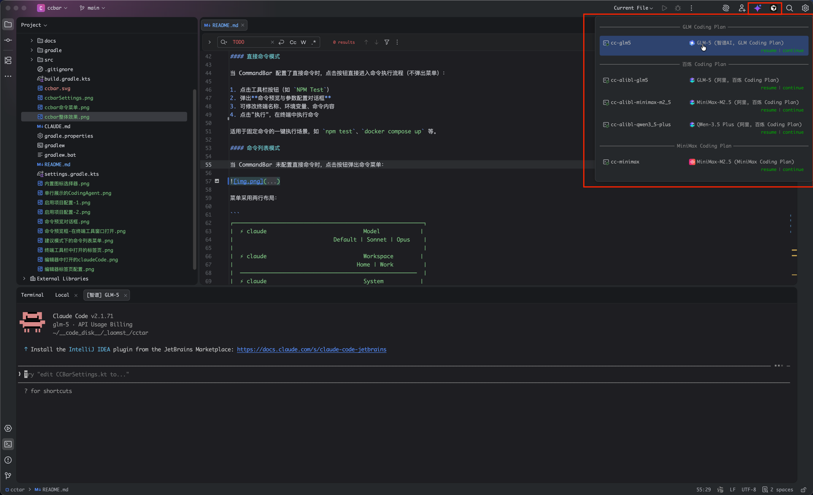

---

## 快速开始

1. 安装插件后，工具栏右侧会自动出现一个默认的 `Claude Code` 按钮
2. 点击按钮，弹出命令菜单，选择命令或快捷参数
3. 在弹出的命令预览对话框中确认或修改参数，点击"执行"
4. 插件自动新建终端标签页并执行命令

进入 **Settings → Tools → CCBar** 可自定义按钮、命令和参数。

---

## 核心概念

CCBar 采用三层配置结构：

```
CommandBar（工具栏按钮）
  ├── [直接命令模式] 绑定固定命令，点击直接执行
  └── [命令列表模式] 点击弹出菜单
        └── Command（命令，绑定基础命令 + 可选工作目录）
              └── QuickParam（快捷参数，绑定参数文本）
```

- **CommandBar**：工具栏上的入口按钮，每个按钮代表一个命令类别
- **Command**：按钮下的命令项，绑定基础命令（如 `claude`）
- **QuickParam**：命令下的快捷参数变体（如 `--model sonnet`），点击后拼接到基础命令后执行

---

## 使用操作

### 两种工作模式

#### 直接命令模式

当 CommandBar 配置了直接命令时，点击按钮直接进入命令执行流程（不弹出菜单）：

1. 点击工具栏按钮（如 `NPM Test`）
2. 弹出**命令预览与参数配置对话框**
3. 可修改终端名称、环境变量、命令内容
4. 点击"执行"，在终端中执行命令

适用于固定命令的一键执行场景，如 `npm test`、`docker compose up` 等。

#### 命令列表模式

当 CommandBar 未配置直接命令时，点击按钮弹出命令菜单：

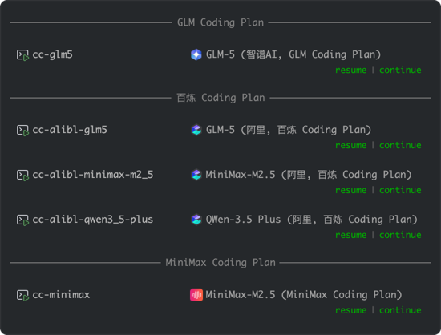

菜单采用两行布局：

```
┌─────────────────────────────────────────────────────────┐
│  ⚡ claude                             Model            │
│                              Default | Sonnet | Opus    │
│                                                         │
│  ⚡ claude                             Workspace        │
│                                     Home | Work         │
│  ─────────────────────────────────────────────────────  │
│  ⚡ claude                             System           │
│                                            Dev          │
└─────────────────────────────────────────────────────────┘
   ↑ 命令预览                              ↑ 命令名称
                                 ↑ 快捷参数（小号绿色文字）
```

**交互说明**：

| 操作 | 效果 |
|------|------|
| 点击**命令名称**区域 | 执行基础命令（不带参数） |
| 点击**命令预览**区域 | 执行基础命令（不带参数） |
| 点击**快捷参数** | 执行基础命令 + 该参数 |
| 鼠标**悬浮**快捷参数 | 命令预览实时更新为完整命令；快捷参数文字变为蓝色 |
| 鼠标**悬浮**整个命令块 | 显示圆角高亮背景 |

点击任意可点击区域后，菜单自动关闭，弹出**命令预览与参数配置对话框**。

### 命令预览与参数配置对话框

无论是直接命令模式还是命令列表模式，执行前都会弹出此对话框，允许用户在执行前做最后的调整：

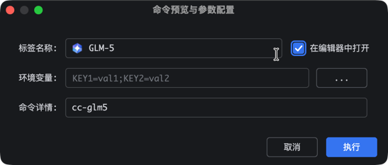

对话框包含三行：

| 行 | 内容 | 说明 |
|----|------|------|
| 第一行 | `标签名称:` 输入框 + `☐ 在编辑器中打开` 复选框 | 输入框左侧可能显示图标和前缀（取决于配置）；复选框切换终端打开模式 |
| 第二行 | `环境变量:` 文本框 + `[...]` 按钮 | 显示合并后的环境变量；文本框可直接编辑，也可点击 `[...]` 打开表格编辑器 |
| 第三行 | `命令详情:` 文本框 | 预填基础命令（末尾带空格），用户可自由编辑追加参数 |

**操作说明**：

- 终端名称不能为空，否则无法提交
- 环境变量格式为 `KEY1=val1;KEY2=val2`，点击 `[...]` 按钮可打开表格编辑器，以两列表格（变量名、值）的形式编辑，支持添加/删除/上移/下移
- 命令文本可自由修改，最终执行的就是文本框中的内容
- 勾选/取消"在编辑器中打开"时，标签名称前的图标和前缀会根据配置动态显示/隐藏
- 点击"执行"按钮或按 Enter 确认执行
- 点击"取消"按钮或按 Esc 取消操作

### 命令生成规则

最终执行的命令由环境变量注入语句 + 命令文本组成：

| 模式 | 点击目标 | 命令文本 |
|------|----------|----------|
| 直接命令 | Button 按钮 | `CommandBar.command` |
| 命令列表 | 命令名称 / 命令预览 | `Command.baseCommand` |
| 命令列表 | 快捷参数 [Sonnet] | `Command.baseCommand --model sonnet` |

如果配置了环境变量，会根据操作系统自动在命令前添加注入语句：

| Shell 类型 | 注入语法 | 示例 |
|-----------|---------|------|
| bash / zsh / sh | `export KEY=val; command` | `export ANTHROPIC_MODEL=sonnet; claude` |
| PowerShell / pwsh | `$env:KEY="val"; command` | `$env:ANTHROPIC_MODEL="sonnet"; claude` |
| cmd.exe | `set KEY=val&& command` | `set ANTHROPIC_MODEL=sonnet&& claude` |

Shell 类型通过 IDE 终端设置中配置的 Shell 路径自动判断。

---

## 终端打开模式

每次命令执行都会**新建**一个终端标签页（不复用已有终端），支持两种打开位置：

### 工具窗口模式（默认）

终端在底部 Terminal 工具窗口中新建标签页，适合常规命令执行。

### 编辑器模式

终端在编辑器区域以 Tab 形式打开，可以与代码文件的 Tab 混排、分屏、拖拽，适合需要长时间运行并频繁切换查看的场景（如 AI 编程助手）。

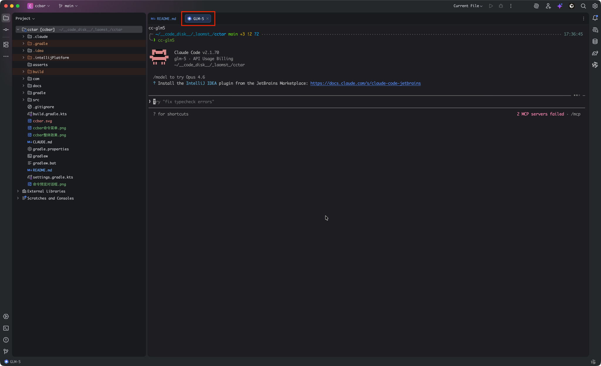

两种模式的终端能力完全一致（输入输出、颜色渲染、Shell Integration、IDE 字体配色、复制粘贴查找等），差异仅在于 Tab 所在的容器位置。

**配置方式**：

- 在设置面板的 CommandBar 详情或 Command 详情中勾选"在编辑器中打开"设置默认模式
- 在命令预览对话框中可临时切换模式（不影响保存的配置）

**固定标签页单独行展示**
如果选择在编辑器中打开，我们可以借助IDE中 `在单独的行展示被固定的标签页` 的配置项让 Coding Agent 在单独的行中展示：
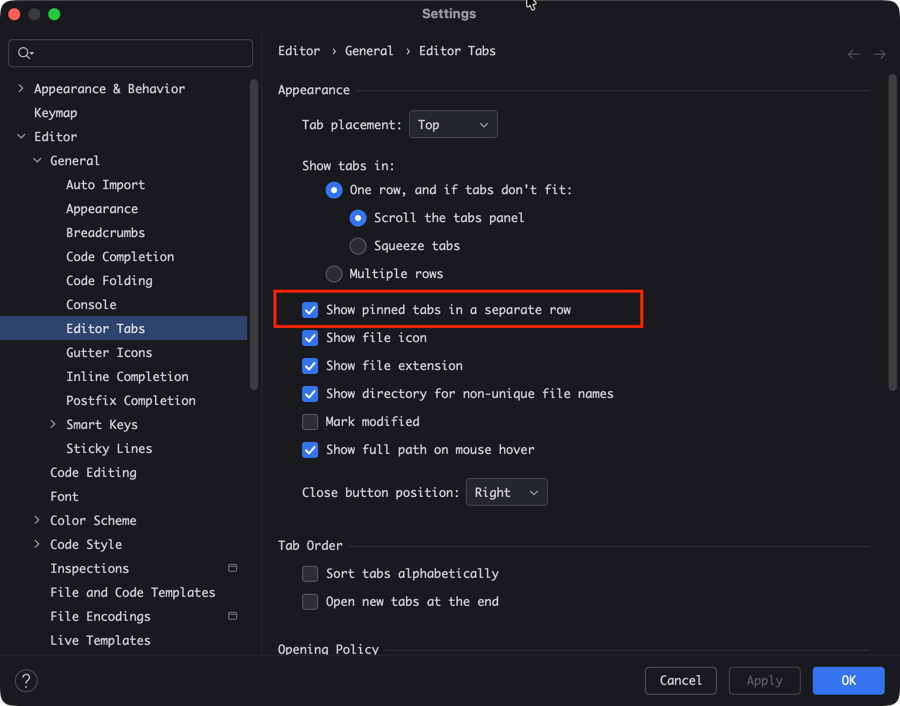
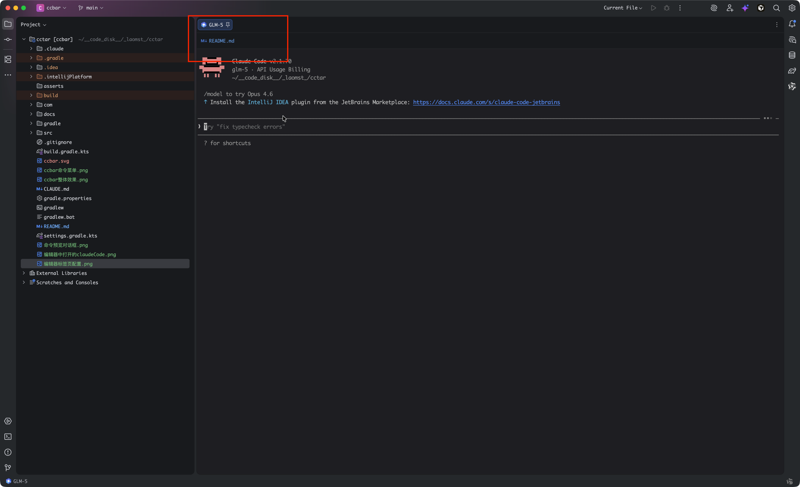
---

## 配置管理

### 设置入口

**Settings → Tools → CCBar**

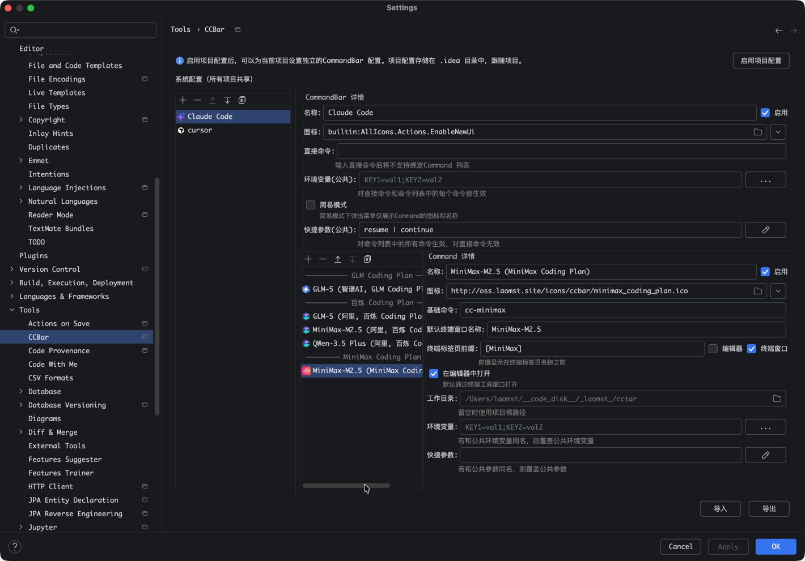

### 设置面板布局

设置面板采用左右分栏结构：

```
┌─────────────────────┬────────────────────────────────────────┐
│  CommandBar 列表     │  CommandBar 详情                       │
│                     │    名称 / 图标 / 直接命令 /              │
│  ▶ Claude Code      │    终端名称 / 前缀 / 终端模式 /          │
│    Dev Tools        │    工作目录 / 环境变量(公共) /            │
│    NPM Test         │    环境变量 / 简易模式 /                 │
│                     │    快捷参数(公共)                        │
│  [+][−][↑][↓]       │  ──────────────────────────────────────│
│                     │  Command 列表         Command 详情      │
│                     │                                        │
│                     │    Model              名称 / 图标       │
│                     │    Workspace          基础命令 / 终端名称│
│                     │    ────────           前缀 / 终端模式   │
│                     │    System             工作目录 / 环境变量│
│                     │                       快捷参数           │
│                     │  [+▼][−][↑][↓]                          │
└─────────────────────┴────────────────────────────────────────┘
底部操作栏：[Import] [Export] [Reset]
```

### 配置 CommandBar（工具栏按钮）

#### 添加按钮

1. 在左侧 CommandBar 列表下方点击 `[+]` 按钮
2. 新按钮添加到列表末尾，右侧显示空白详情表单
3. 填写以下信息：

| 字段 | 说明 | 必填 |
|------|------|------|
| 名称 | 工具栏按钮显示名称，同一配置内唯一 | 是 |
| 图标 | 按钮图标（详见[图标自定义](#图标自定义)） | 是 |
| 直接命令 | 填写后启用直接命令模式；留空则使用命令列表模式 | 否 |

4. 点击 `Apply` 保存

#### 直接命令模式的额外字段

当"直接命令"字段非空时，自动切换为直接命令模式，额外显示以下字段：

| 字段 | 说明 |
|------|------|
| 默认终端窗口名称 | 命令预览对话框中的默认终端标签页名称 |
| 终端标签页前缀 | 显示在终端名称前的前缀文本（支持 emoji） |
| 在编辑器中打开 | 勾选后默认使用编辑器模式打开终端 |
| 工作目录 | 终端工作目录，留空使用项目根目录 |
| 环境变量(公共) | 公共环境变量，格式 `KEY1=val1;KEY2=val2` |
| 环境变量 | 直接命令专用环境变量，同名时覆盖公共环境变量 |

输入"直接命令"后，下方的 Command 列表区域自动隐藏（直接命令模式不支持 Command 列表）。清空"直接命令"字段即可切换回命令列表模式。

#### 命令列表模式的额外字段

当"直接命令"字段为空时，显示以下字段：

| 字段 | 说明 |
|------|------|
| 环境变量(公共) | 公共环境变量，对该 CommandBar 下所有 Command 生效 |
| 简易模式 | 勾选后弹出菜单仅显示 Command 图标和名称，隐藏命令预览和快捷参数 |
| 快捷参数(公共) | 公共快捷参数，对所有 Command 统一生效（简易模式下隐藏） |

#### 编辑/删除/排序按钮

- 左侧列表选中某个按钮后，右侧自动显示其详情，可直接编辑
- `[−]` 删除选中的按钮
- `[↑]` `[↓]` 调整按钮在工具栏中的顺序

#### 启用/禁用按钮

每个 CommandBar 详情区域右上角有"启用"复选框：

- 取消勾选后，按钮数据保留但不在工具栏中显示
- 设置面板中禁用项显示为灰色
- 随时可重新勾选启用

### 配置 Command（命令）

Command 列表位于右侧面板的下方区域，仅在命令列表模式下显示。

#### 添加命令

Command 列表下方的 `[+▼]` 是一个下拉菜单按钮，提供两个选项：

- **添加命令**：添加一个普通 Command
- **添加分割线**：添加一条分割线用于分组

添加普通命令后，填写以下信息：

| 字段 | 说明 | 必填 |
|------|------|------|
| 名称 | 命令名称，同一 CommandBar 下唯一 | 是 |
| 图标 | 命令图标，显示在弹出菜单和设置面板中 | 否 |
| 基础命令 | 命令主体，如 `claude`、`npm` | 是 |
| 默认终端窗口名称 | 命令预览对话框中的默认终端名称 | 是 |
| 终端标签页前缀 | 终端名称前缀文本（支持 emoji），可分别控制在编辑器和终端窗口中是否显示 |
| 在编辑器中打开 | 勾选后默认使用编辑器模式 | 否 |
| 工作目录 | 终端工作目录，留空使用项目根目录 | 否 |
| 环境变量 | Command 级环境变量，同名时覆盖 CommandBar 的公共环境变量 | 否 |
| 快捷参数 | 点击编辑按钮打开快捷参数编辑对话框 | 否 |

#### 命令分割线

分割线用于在弹出菜单中对命令进行视觉分组：

- 分割线可设置名称，有名称时在菜单中显示为带文字的分隔线，无名称时显示为普通水平线
- 分割线没有"启用"复选框（始终显示）
- 选中分割线时，右侧 Command 详情面板隐藏

#### 编辑快捷参数

1. 选中某个 Command
2. 点击快捷参数行的编辑按钮（铅笔图标）
3. 弹出快捷参数编辑对话框，以表格形式编辑：

| 列 | 说明 |
|----|------|
| 名称 | 快捷参数在菜单中显示的按钮文字 |
| 参数 | 拼接到基础命令后的参数文本 |

4. 支持添加/删除/上移/下移操作
5. 点击"确定"保存，"取消"放弃修改

#### 启用/禁用 Command 和 QuickParam

与 CommandBar 类似，Command 和 QuickParam 都有"启用"复选框：

- 禁用后数据保留，但不在弹出菜单中显示
- 设置面板中禁用项显示为灰色

### 环境变量配置

环境变量支持两层配置，执行时自动合并注入。

#### 配置层级

| 层级 | 字段位置 | 生效范围 |
|------|---------|---------|
| 公共环境变量 | CommandBar 详情 → "环境变量(公共)" | 对该 CommandBar 下所有 Command 和直接命令生效 |
| 命令级环境变量（命令列表模式） | Command 详情 → "环境变量" | 仅对该 Command 生效 |
| 命令级环境变量（直接命令模式） | CommandBar 详情 → "环境变量" | 仅对该直接命令生效 |

#### 合并规则

- **直接命令模式**：公共环境变量 + CommandBar 的环境变量（后者覆盖同名变量）
- **命令列表模式**：公共环境变量 + Command 的环境变量（后者覆盖同名变量）

#### 编辑方式

每个环境变量字段都提供两种编辑方式：

1. **文本框直接编辑**：直接输入 `KEY1=val1;KEY2=val2` 格式
2. **表格编辑器**：点击 `[...]` 按钮打开表格编辑对话框，以两列表格（变量名、值）编辑，支持添加/删除/上移/下移

### 快捷参数配置

#### Command 级快捷参数

每个 Command 可配置多个快捷参数，在弹出菜单中显示为可点击的小号文字按钮，点击后将参数拼接到基础命令后执行。

#### 公共快捷参数

CommandBar 级别可配置公共快捷参数（仅命令列表模式生效）：

- 对该 CommandBar 下所有 Command 统一生效，减少跨 Command 的重复配置
- 在 CommandBar 详情区域点击"快捷参数(公共)"行的编辑按钮进行配置
- 编辑方式与 Command 级快捷参数相同

#### 合并规则

弹出菜单中显示的快捷参数为公共和 Command 级的合并结果：

1. 以 `name` 字段判断同名
2. Command 中同名的快捷参数**完全替换**公共快捷参数
3. 合并顺序：公共快捷参数（未被覆盖的）在前，Command 自身的快捷参数在后
4. 仅显示启用状态的快捷参数

### 图标自定义

CommandBar、Command、QuickParam 均支持自定义图标，共支持三种类型：

| 图标类型 | 格式 | 示例 | 说明 |
|---------|------|------|------|
| IDEA 内置图标 | `builtin:` 前缀 | `builtin:AllIcons.Actions.Execute` | 点击图标字段旁的 `▼` 按钮可打开内置图标选择器浏览选取 |
| 本地文件 | `file:` 前缀或直接路径 | `file:/path/to/icon.svg` | 点击图标字段旁的浏览按钮选择文件；支持 SVG、PNG、JPG、GIF、BMP、ICO |
| 网络图片 | `http://` 或 `https://` | `https://example.com/icon.png` | 异步下载并缓存到 `<IDEA_SYSTEM>/ccbar/icon-cache/`；下载失败时使用默认图标 |

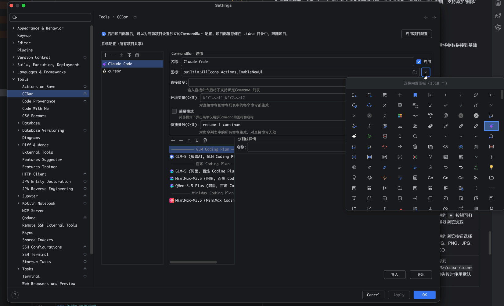

### 简易模式

CommandBar 可开启简易模式（勾选"简易模式"复选框）：

- 弹出菜单仅显示 Command 的图标和名称，不显示命令预览和快捷参数
- 鼠标悬浮时 tooltip 显示基础命令文本
- 设置面板中，简易模式下"快捷参数(公共)"编辑区域自动隐藏
- 适合命令数量较多但不需要快捷参数快速切换的场景

简易模式下的命令列表弹框如下：

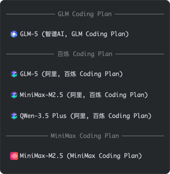

### 终端标签页前缀

可为终端标签页名称添加前缀标识，方便在多个终端中快速区分类别：

- 在 CommandBar（直接命令模式）和 Command 级别分别配置
- 前缀文本支持 emoji（如 `🤖`、`[CC]`）
- 两个独立复选框分别控制前缀在编辑器标签页和终端工具窗口标签页中的显示
- 前缀与终端名称之间自动添加空格，最终显示为 `前缀 终端名称`
- 编辑器模式下，终端标签页还会显示 Command/CommandBar 配置的图标

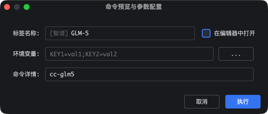
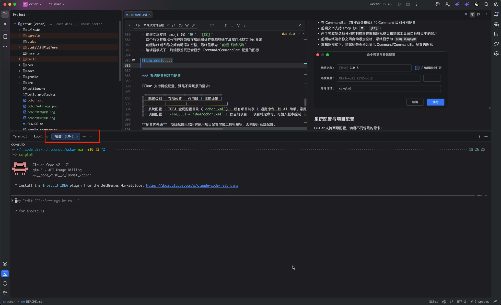

### 系统配置与项目配置

CCBar 支持两级配置，满足不同场景的需求：

| 配置级别 | 存储位置 | 作用域 | 适用场景 |
|---------|---------|--------|----------|
| 系统配置 | IDEA 全局配置目录 (`ccbar.xml`) | 所有项目共享 | 通用命令，如 AI 助手、常用脚本 |
| 项目配置 | `<PROJECT>/.idea/ccbar.xml` | 仅当前项目 | 项目特定命令，可加入版本控制 |

**配置优先级**：项目配置已启用时使用项目配置渲染工具栏按钮，否则使用系统配置。

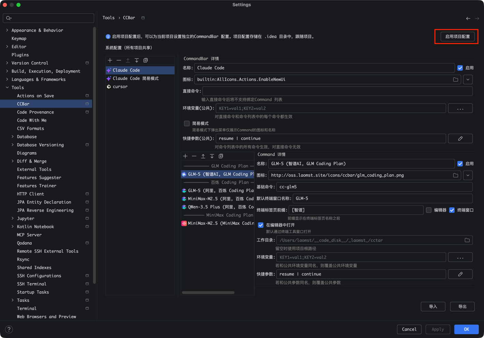
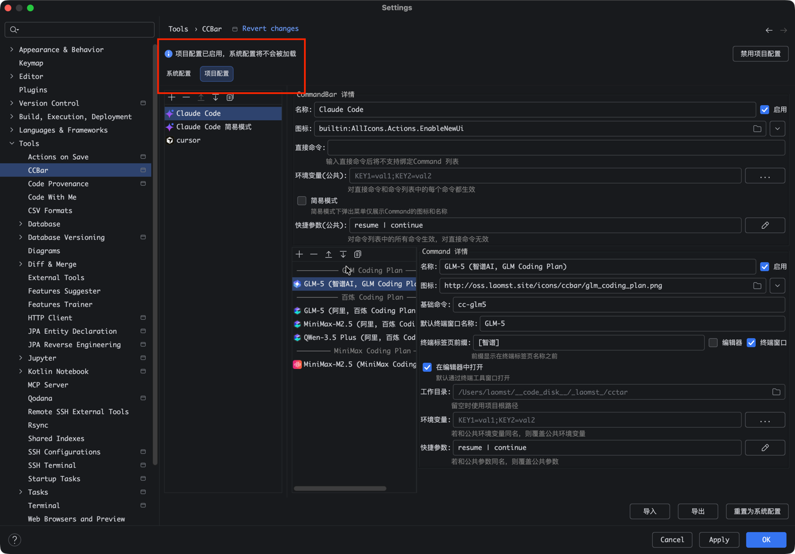

#### 启用项目配置

设置面板中如果当前没有启用的项目配置，会显示"启用项目配置"按钮。点击后：

1. 当前系统配置被复制到项目配置
2. 项目配置标记为启用
3. 设置面板切换为 Tab 模式，显示"系统配置"和"项目配置"两个 Tab

#### 管理项目配置

项目配置启用后，设置面板顶部出现两个 Tab：

- **系统配置 Tab**：编辑全局系统配置
- **项目配置 Tab**：编辑当前项目的独立配置，包含以下额外操作按钮：
  - **禁用项目配置**：停用项目配置（数据保留不删除），工具栏回退使用系统配置
  - **重置为系统配置**：将项目配置重置为当前系统配置的副本

### 导入/导出配置

设置面板底部提供三个操作按钮：

| 按钮 | 功能 |
|------|------|
| **Import** | 从 JSON 文件导入配置，覆盖当前配置 |
| **Export** | 将当前配置导出为 JSON 文件 |
| **Reset** | 恢复默认配置（需确认） |

导入/导出使用 JSON 格式，便于跨环境迁移或团队共享配置。

---

## 典型使用场景

### AI 编程助手快速启动

配置一个 `Claude Code` CommandBar（命令列表模式），按不同维度分组命令：

| 命令名称 | 基础命令 | 快捷参数 | 执行效果 |
|---------|---------|---------|---------|
| Model | `claude` | [Sonnet] [Opus] | 快速切换模型 |
| Workspace | `claude` | [Home] [Work] | 快速切换工作区 |
| System | `claude` | [Dev] | 使用不同系统提示 |

配合公共环境变量设置 `ANTHROPIC_MODEL=claude-sonnet-4-20250514`，所有命令统一使用默认模型。开启编辑器模式，终端以 Tab 形式与代码并排显示。

### 项目构建脚本

配置一个 `Dev Tools` CommandBar（命令列表模式）：

| 命令名称 | 基础命令 | 快捷参数 | 执行效果 |
|---------|---------|---------|---------|
| NPM | `npm` | [Test] [Build] [Dev] | 快速执行 npm 脚本 |
| Docker | `docker compose` | [Up] [Down] [Logs] | 管理 Docker 容器 |

使用分割线将不同类别的命令分组，提高菜单可读性。

### 一键执行

对于固定命令（如 `npm test`），配置一个 `NPM Test` CommandBar（直接命令模式），command 设为 `npm test`，点击按钮即可执行。

### 多项目差异化配置

为不同项目启用项目级配置，各项目使用独立的命令集和参数。项目配置文件位于 `.idea/ccbar.xml`，可加入版本控制实现团队共享。

---

## 安装

### 从源码构建

```bash
git clone <repository-url>
cd ccbar
./gradlew buildPlugin
```

构建产物位于 `build/distributions/` 目录，为 ZIP 格式插件包。

在 IDEA 中通过 **Settings → Plugins → Install Plugin from Disk...** 安装。

### 开发调试

```bash
./gradlew runIde    # 启动沙箱 IDEA 实例并加载插件
```

## 兼容性

- IntelliJ IDEA 2024.2+（Build 242+）
- 基于 IntelliJ Platform 的其他 IDE（如 WebStorm、PyCharm 等）
- JDK 17+

## 文档

- [需求文档](docs/spec.md) — 完整产品需求与配置数据结构
- [技术设计](docs/tech-design.md) — 技术选型与架构设计
- [开发计划](docs/dev-plan.md) — Story 列表与开发进度
- [特性规格](docs/specs/) — 各 Story 的详细规格文档

## 已知问题

### 中文输入法在交互式 CLI 中字母上屏卡顿

在插件打开的终端窗口中运行交互式 CLI（如 Claude Code CLI、Codex 等）时，使用中文输入法输入会出现字母上屏卡顿的现象。

经调查，这**并非本插件引入的问题**，而是 IntelliJ 平台终端的已知缺陷。在 IDEA 官方的运行面板（Run/Debug Configurations）中配置一个 Shell Script 并选择"在终端中运行（Run in Terminal）"时，打开的终端窗口中同样存在此问题。

**影响范围**：所有通过 IntelliJ 平台 API 创建的终端窗口（包括工具窗口模式和编辑器模式）。

**临时解决方案**：
- 直接通过 IDEA 底部的 Terminal 工具窗口手动打开终端并运行命令，不存在此问题
- 使用外部终端（如 macOS Terminal、iTerm2、Windows Terminal 等）运行交互式 CLI 也可规避

## License

MIT
